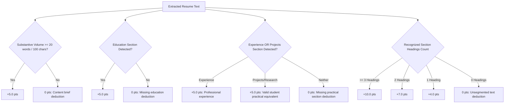
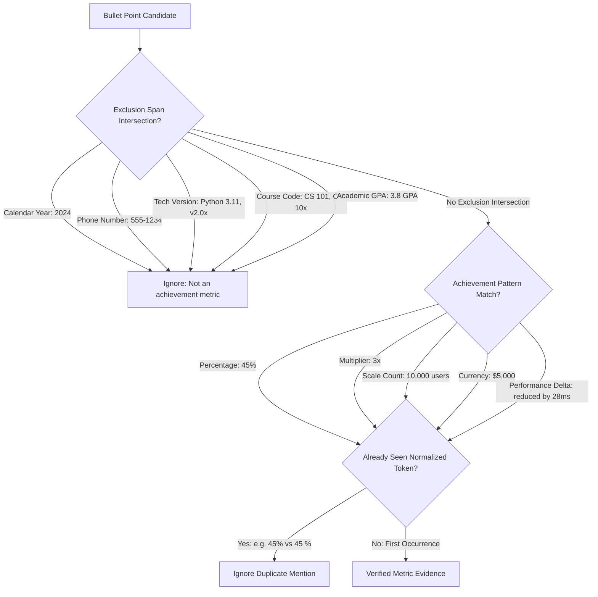

# Explainable, Rule-Based Resume Feedback Rubric

## 1. Pedagogical Objective & Non-Goals

The **Resume Feedback Index** is a deterministic, explainable rubric engineered to assist college students and early-career software developers in improving their resume content, document hierarchy, and measurable impact.

> [!IMPORTANT]
> **Academic & Ethical Disclaimer:**
> This rubric is a formative pedagogical aid. It is:
> - **NOT an automated ATS screening score** or simulation of proprietary recruitment software.
> - **NOT a hiring probability**, candidate qualification rating, or employability index.
> - **NOT a prediction of interview outcomes** or job placement likelihood.
>
> High scores reflect adherence to structural and quantification best practices; they do not guarantee candidate competency. Missing information reflects parser detection limits, not confirmed absence of ability.

---

## 2. Four Rubric Dimensions & Scoring Formulation

The rubric evaluates resumes across **four separate, equally weighted dimensions** (25.0 points maximum each, totaling 100.0 points maximum). An aggregate total is provided solely as a heuristic feedback index; dimension breakdowns must always be reviewed individually.

$$\text{Resume Feedback Index} = \text{Score}_{\text{Structure}} + \text{Score}_{\text{Contacts}} + \text{Score}_{\text{Impact}} + \text{Score}_{\text{Skills}}$$

```
Total Score Tiers:
- [85.0 - 100.0]: Exemplary
- [70.0 - 84.9]:  Proficient
- [50.0 - 69.9]:  Developing
- [0.0 - 49.9]:   Needs Significant Work
```

---

### Dimension 1: Resume Structure (25.0 Points Max)

Evaluates whether the document possesses sufficient substantive content, a recognizable section hierarchy, and essential foundational sections.



#### Detailed Point Breakdown:
1. **Substantive Usable Volume (5.0 pts):**
   - $\ge 100\text{ characters}$ and $\ge 20\text{ words}$: **+5.0 pts**.
   - $< 20\text{ words}$ or $< 100\text{ characters}$: **0 pts** (Deduction: *-5.0 pts: Content is extremely brief; insufficient substantive text for full evaluation*).
2. **Educational Foundation (5.0 pts):**
   - Recognized `Education` section detected: **+5.0 pts**.
   - Absent: **0 pts** (Deduction: *-5.0 pts: Missing recognized Education section*).
3. **Student Practical Foundation (5.0 pts):**
   - Recognized `Experience` or `Work` section detected: **+5.0 pts**.
   - Alternatively, recognized `Projects` or `Research` section detected: **+5.0 pts** (*Full credit awarded to student candidates demonstrating technical capability through coursework or personal projects*).
   - Both absent: **0 pts** (Deduction: *-5.0 pts: Missing both Experience and Projects sections*).
4. **Heading Organization & Hierarchy (10.0 pts):**
   - $\ge 3$ distinct recognized section headings: **+10.0 pts**.
   - $2$ section headings: **+7.0 pts** (Deduction: *-3.0 pts: Limited section segmentation*).
   - $1$ section heading: **+4.0 pts** (Deduction: *-6.0 pts: Minimal section segmentation*).
   - $0$ recognized headings: **0.0 pts** (Deduction: *-10.0 pts: Document parsed as unsegmented text*).

---

### Dimension 2: Contact Completeness (25.0 Points Max)

Evaluates whether the parser identifies standard communication channels and candidate identity with reasonable confidence.

#### Detailed Point Breakdown:
1. **Valid Email Address (10.0 pts):**
   - RFC-compliant email detected: **+10.0 pts**.
   - Absent: **0 pts** (Deduction: *-10.0 pts: Missing valid email address.*).
2. **Valid Telephone Number (7.0 pts):**
   - Bounded telephone number (7-15 digits, excluding single years/dates): **+7.0 pts**.
   - Absent: **0 pts** (Deduction: *-7.0 pts: Telephone number not identified.*).
3. **Online Professional Presence (5.0 pts):**
   - $\ge 2$ professional links (e.g. GitHub, LinkedIn, portfolio): **+5.0 pts** (Full credit).
   - $1$ professional link: **+3.0 pts** (Deduction: *-2.0 pts: Only 1 online professional link identified (consider providing both GitHub and LinkedIn or a portfolio link).*).
   - $0$ links: **0 pts** (Deduction: *-5.0 pts: No online professional profile (GitHub, LinkedIn, or Portfolio) identified.*).
4. **Header Name Confidence (3.0 pts):**
   - High-confidence 2-4 word capitalized name header detected in initial 2 lines: **+3.0 pts**.
   - Absent, disallowed title (e.g., "Software Engineer", "Resume"), or unsegmented multi-column layout: **0 pts** (Deduction: *-3.0 pts: Candidate name header could not be identified with high confidence (first line may contain title, contact details, or multi-column layout).*).

> [!NOTE]
> **Audit Reconciliation Note:**
> In previous preliminary drafts, an example resume with 1 link (Alex Smith, GitHub only) was informally described as scoring 100.0. Under the audited additive rubric, Alex Smith correctly receives $+3.0\text{ pts}$ for 1 link with a documented $-2.0\text{ pts}$ deduction, yielding an exact contact score of $23.0 / 25.0$ and an aggregate index score of $98.0 / 100.0$ (Exemplary tier).

---

### Dimension 3: Quantified Impact (25.0 Points Max)

Inspects project and experience bullets for verified numerical indicators of measurable outcomes while enforcing strict exclusion spans and token normalization to prevent false positives and artificial inflation.



#### Detailed Point Breakdown:
- **$\ge 3$ Verified Distinct Metrics Detected:** **25.0 pts** (*Exemplary demonstration of measurable outcomes*).
- **$2$ Verified Distinct Metrics Detected:** **20.0 pts** (Deduction: *-5.0 pts: Could benefit from 1-2 additional quantified metrics*).
- **$1$ Verified Distinct Metric Detected:** **14.0 pts** (Deduction: *-11.0 pts: Limited quantifiable evidence across bullets*).
- **$0$ Verified Metrics with Practical Section Present:** **5.0 pts** (Deduction: *-20.0 pts: Bullets are purely narrative with no concrete quantified impact metrics detected*).
- **$0$ Practical Sections Detected:** **0.0 pts** (Deduction: *-25.0 pts: No project or experience text detected*).

> [!TIP]
> **Ethical Guidance:**
> The system explicitly advises students to only report honest, verified metrics based on actual project outcomes, never inventing fake numbers or claiming unearned scale.

---

### Dimension 4: Skill-Taxonomy Coverage (25.0 Points Max)

Operates in one of two distinct, mutually exclusive modes depending on whether a target job description is supplied. Exposes the complete list of canonical `detected_resume_skills` in the response.

#### Mode A: Role-Specific Job Alignment (When Job Description is Provided)
When a target job description containing technical skills is supplied, the score reflects explicit requirement coverage:

$$\text{Score}_{\text{Skills}} = 25.0 \times \left( \frac{|\text{Matched Skills}|}{|\text{Target JD Skills}|} \right)$$

- **Partition Guarantees:** Matched and missing skills are strictly disjoint ($S_{\text{matched}} \cap S_{\text{missing}} = \emptyset$), and their union strictly equals all recognized JD skills ($S_{\text{matched}} \cup S_{\text{missing}} = S_{\text{target JD}}$).
- **Zero-Skill Fallback:** If the target job description contains 0 recognized technical skills from the taxonomy, `has_job_description` remains `True`, `job_description_skills_count` is reported as `0`, and the engine safely evaluates general taxonomy breadth without division by zero or misleading full-coverage claims.
- **Taxonomy Scope:** Recognized skills represent canonical technical terms from the project dictionary, distinguishing recognized taxonomy skills from domain-specific or uncataloged soft skills.

#### Mode B: General Taxonomy Breadth (When No Job Description is Provided)
When evaluating general resume quality without a specific role target:
- $\ge 6$ skills across $\ge 2$ taxonomy categories: **25.0 pts** (*Broad technical coverage*).
- $\ge 4$ skills across $\ge 2$ taxonomy categories: **20.0 pts** (Deduction: *-5.0 pts: Moderate technical taxonomy breadth*).
- $\ge 2$ skills: **14.0 pts** (Deduction: *-11.0 pts: Limited technical skill diversity detected*).
- $1$ skill: **8.0 pts** (Deduction: *-17.0 pts: Only 1 recognized technical skill detected*).
- $0$ skills: **0.0 pts** (Deduction: *-25.0 pts: No canonical technical skills detected*).

---

## 3. Prioritized Actionable Recommendations

Suggestions are ranked dynamically:
1. Dimensions with the lowest percentage score are prioritized first.
2. Deductions are mapped directly to concrete, actionable advice (e.g., applying the Google XYZ formula: *"Accomplished [X] as measured by [Y], by doing [Z]"*).
3. Explicit ethical warnings are attached: candidates are advised never to fabricate metrics or list skills they have not used.
4. If all heuristic checks pass strongly, constructive tailoring advice is supplied to ensure candidates receive actionable feedback.

---

## 4. Known Edge Cases, False Positives, and False Negatives

| Scenario | System Behavior | Rationale / Limitation |
| :--- | :--- | :--- |
| **Coursework & Projects Only** | Full practical credit (+5 pts) in Structure. | Prevents bias against students without corporate employment. |
| **Dates (e.g. 2021-2024, May 2024)** | Excluded via `YEAR_PATTERN`. | Calendar years indicate duration/timeline, not accomplishment scale. |
| **Version Numbers (e.g. Python 3.11, v2.0x)** | Excluded via `VERSION_NUMBER_PATTERN` and lookbehinds. | Language versions are technical nouns, not achievement deltas. |
| **Course Codes (e.g. CS 101, CS 10x)** | Excluded via `COURSE_CODE_PATTERN`. | Academic identifiers are not performance metrics. |
| **GPA (e.g. 3.8 / 4.0 GPA)** | Excluded via `GPA_PATTERN`. | Academic grade averages evaluate coursework, not project delivery. |
| **Repeated Metric Mentions (e.g. 45% vs 45 %)** | Normalized and deduplicated. | Prevents inflating metric counts by restating identical accomplishments. |
| **Spelled-Out Numbers (e.g. "three hundred users")** | Not currently detected (False Negative). | System conservatively parses digits and scale suffixes ($k, m, b$) to prevent false positive matches on descriptive English words. |
| **Non-Standard Section Headers (e.g. "What I Did")** | Parsed as unsegmented body text. | Rubric encourages standard headings to facilitate human and machine readability. |

---

## 5. Verification & Testing

To verify the feedback rubric implementation and regression suite:

```bash
# Run the complete test suite (141 passing tests)
python -m pytest -v

# Run the feedback-specific test suite (22 passing tests)
python -m pytest tests/test_resume_feedback.py -v

# Execute the Phase 7 evaluation benchmark
python scripts/evaluate_matching.py
```
