# Student Resume Analyzer — Class Diagram

## Purpose
This class diagram represents the core object-oriented and data-modeling architecture of the Student Resume Analyzer backend. It depicts the relationships between configuration objects, domain extraction services, NLP parsers, matching/scoring services, and Pydantic request/response schemas.

---

## Diagram

```mermaid
classDiagram
    direction TB

    %% Configuration
    class Settings {
        +str APP_NAME
        +str VERSION
        +bool APP_DEBUG
        +list ALLOWED_EXTENSIONS
        +int MAX_UPLOAD_SIZE_MB
        +int MAX_PAGE_COUNT
        +int MIN_EXTRACTED_CHARS_WARNING
        +int MIN_PAGE_CHARS_SCANNED_CHECK
        +list ALLOWED_ORIGINS
    }

    %% Document Ingestion Services
    class PDFExtractorService {
        +int max_page_count
        +int min_extracted_chars_warning
        +int min_page_chars_scanned
        +extract_text_from_bytes(pdf_bytes, filename) ResumeExtractionResponse
        -_extract_with_pdfplumber(pdf_bytes)
        -_extract_with_pypdf(pdf_bytes)
    }

    class DocxExtractorService {
        +int max_page_count
        +int min_extracted_chars_warning
        +int min_page_chars_scanned
        +extract_text_from_bytes(docx_bytes, filename) ResumeExtractionResponse
        -_extract_document_elements(doc) Tuple
    }

    %% NLP Parsing Services
    class ResumeParserService {
        +parse_resume_text(text, filename) StructuredResumeResponse
    }

    class SectionDetector {
        +detect_sections(text) Tuple
        -_is_heading(line) bool
    }

    class ContactExtractor {
        +extract_contact_info(text) ExtractedContactInfo
        -_extract_email(text) str
        -_extract_phone(text) str
        -_extract_urls(text) dict
    }

    class SkillExtractor {
        +extract_skills(text) Tuple
        -_match_taxonomy(text) list
    }

    %% Alignment and Scoring Services
    class JobMatcherService {
        +match(resume_text, job_description, resume_filename) JobMatchResponse
        -_compute_tfidf_similarity(text1, text2) float
        -_compute_skill_overlap(skills1, skills2) dict
    }

    class FeedbackAnalyzerService {
        +generate_feedback(resume_text, job_description, resume_filename) ResumeFeedbackResponse
        -_score_structure(text, sections) FeedbackDimensionScore
        -_score_contacts(contacts, name) FeedbackDimensionScore
        -_score_quantified_impact(text) FeedbackDimensionScore
        -_score_skills(resume_skills, jd_skills) FeedbackDimensionScore
    }

    %% Data Schemas
    class ResumeExtractionResponse {
        +str filename
        +int page_count
        +int character_count
        +int word_count
        +str extracted_text
        +bool is_scanned_or_image_based
        +list warnings
        +str parser_status
        +str parser_engine
    }

    class StructuredResumeResponse {
        +str filename
        +list detected_sections
        +ExtractedContactInfo contact_info
        +list skills
        +dict skills_by_category
        +int total_skills_count
    }

    class JobMatchResponse {
        +float text_similarity
        +float skill_overlap_ratio
        +list matched_skills
        +list missing_skills
        +list additional_skills
        +str methodology_notice
    }

    class ResumeFeedbackResponse {
        +float total_score
        +str index_label
        +dict dimensions
        +list recommendations
        +list quantified_metrics_detected
        +list detected_resume_skills
        +str disclaimer
    }

    %% Relationships
    Settings <.. PDFExtractorService : configures
    Settings <.. DocxExtractorService : configures

    PDFExtractorService ..> ResumeExtractionResponse : produces
    DocxExtractorService ..> ResumeExtractionResponse : produces

    ResumeParserService --> SectionDetector : delegates to
    ResumeParserService --> ContactExtractor : delegates to
    ResumeParserService --> SkillExtractor : delegates to
    ResumeParserService ..> StructuredResumeResponse : produces

    JobMatcherService --> SkillExtractor : uses
    JobMatcherService ..> JobMatchResponse : produces

    FeedbackAnalyzerService --> SectionDetector : uses
    FeedbackAnalyzerService --> ContactExtractor : uses
    FeedbackAnalyzerService --> SkillExtractor : uses
    FeedbackAnalyzerService ..> ResumeFeedbackResponse : produces
```

---

## Explanation of Class Roles

1. **`Settings`:** Central application configuration loaded from environment variables and `.env`. Controls maximum upload sizes, allowed extensions (`pdf`, `docx`), and diagnostic thresholds.
2. **`PDFExtractorService` & `DocxExtractorService`:** Independent document ingestion services that accept raw byte streams, execute format-specific integrity checks, and output uniform `ResumeExtractionResponse` records.
3. **`ResumeParserService`:** Façade service aggregating `SectionDetector` (heading boundary detection), `ContactExtractor` (regex coordinate parser), and `SkillExtractor` (taxonomy dictionary matcher).
4. **`JobMatcherService`:** Computes explainable lexical alignment using scikit-learn's `TfidfVectorizer` and calculates canonical skill set overlap.
5. **`FeedbackAnalyzerService`:** Evaluates text against the 4-dimension formative rubric, applying exclusion guards against date/phone false positives to evaluate quantified impact.
6. **Schemas:** Pydantic models enforcing strict contract boundaries, input validation, and type serialization across API endpoints.
