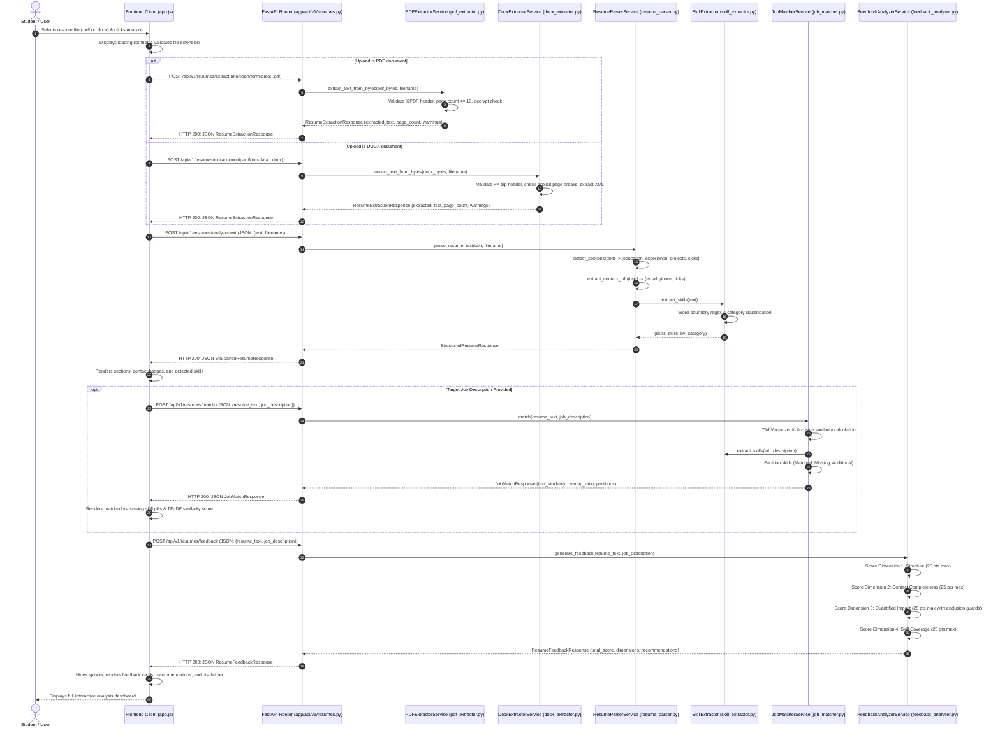

# Student Resume Analyzer — Sequence Diagram

## Purpose
This sequence diagram depicts the chronological interactions among client and server components during an end-to-end resume evaluation session. It demonstrates how format-specific extractors handle document ingestion, how downstream NLP services parse text and extract entities, and how the frontend coordinates asynchronous HTTP calls using **verbatim code-derived endpoint paths**.

---

## Diagram

---

## Explanation of Interactions

1. **Document Ingestion (`POST /api/v1/resumes/extract`):** The frontend sends a multipart file upload. FastAPI routes `.pdf` files to `PDFExtractorService` and `.docx` files to `DocxExtractorService`. Both extractors execute in-memory with zero disk persistence, returning identical `ResumeExtractionResponse` structures.
2. **Text Parsing (`POST /api/v1/resumes/analyze-text`):** The extracted plain text is transmitted to the structured parser. `ResumeParserService` orchestrates section detection, contact extraction (email, phone, LinkedIn, GitHub), and taxonomy skill identification.
3. **Job Matching (`POST /api/v1/resumes/match`):** If the user provided a job description, the frontend requests lexical matching. `JobMatcherService` computes TF-IDF cosine similarity and standardizes skill overlap.
4. **Pedagogical Feedback (`POST /api/v1/resumes/feedback`):** The text is scored against the four-dimension rubric. Actionable suggestions and quantified metrics are returned to the client.
5. **Safe Rendering:** The frontend updates DOM elements strictly using `textContent` to prevent script injection.
