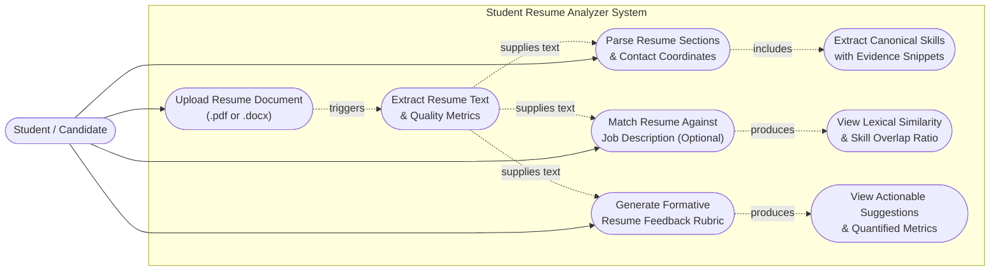

# Student Resume Analyzer — Use Case Diagram

## Purpose
This diagram illustrates the primary functional capabilities provided to the **Student / Candidate User** by the Student Resume Analyzer application. It reflects only the features and interactions supported by the current implementation: uploading documents, extracting readable text, analyzing sections and skills, comparing against job descriptions, and receiving rule-based heuristic feedback.

---

## Diagram

---

## Explanation of Use Cases

1. **Upload Resume Document (.pdf or .docx):** The student uploads a resume via the web client dropzone or file selector. Supports modern Word (`.docx`) and text-based PDF (`.pdf`) files under 5 MB. Legacy binary `.doc` files are rejected with conversion instructions.
2. **Extract Resume Text & Quality Metrics:** Validates file magic bytes and extracts plain text in-memory. Assesses document health, flagging scanned or low-text documents.
3. **Parse Resume Sections & Contact Coordinates:** Identifies resume sections (Education, Experience, Projects, Skills) and extracts verified contact details (Email, Phone, LinkedIn, GitHub, Portfolio).
4. **Extract Canonical Skills with Evidence Snippets:** Matches resume content against a standardized taxonomy of 45+ technical skills, capturing surrounding bullet text as provenance evidence.
5. **Match Resume Against Job Description (Optional):** Compares resume text with an optional target job description using explainable TF-IDF cosine similarity and canonical skill overlap.
6. **View Lexical Similarity & Skill Overlap Ratio:** Displays matched skills, missing skills, and additional skills without proprietary black-box scoring.
7. **Generate Formative Resume Feedback Rubric:** Analyzes resume text across four transparent dimensions: Structure, Contact Completeness, Quantified Impact, and Skill Coverage.
8. **View Actionable Suggestions & Quantified Metrics:** Displays concrete feedback points, detected metrics (e.g. percentages, counts, savings), and suggestions for resume enhancement.
